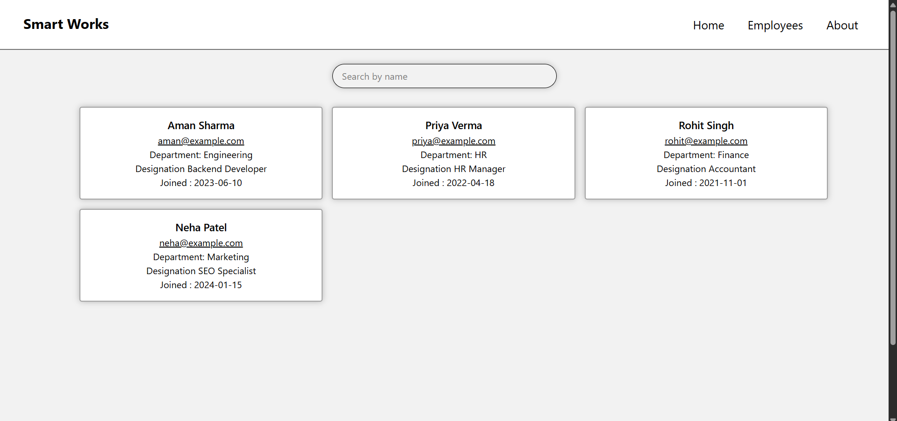

# Employee Directory Search System (FastAPI + MySQL + React + Vite)

## Database Choice
As per the company-specified stack, raw MySQL was used.

<p align="center">
  
</p>

## How search performance is optimized (conceptually)?
### By using Debouncing:
- Instead of runing the fetchEmployee function everytime the user types something.
- We wait for about 200ms to 500ms which reduces the number of api calls by a lot

---

## Tech Stack

### Backend
- FastAPI
- MySQL
- mysql-connector-python
- Uvicorn
- python-dotenv

### Frontend
- React (TypeScript)
- Vite
- Axios
- Tailwind CSS

---

## Project Structure

valiaPlacement/ <br>
│<br>
├── server/<br>
│ ├── index.py # FastAPI application entry point<br>
│ ├── db.py # Database connection & pooling logic<br>
│ |── .venv/ # Python virtual environment<br>
│ └── .env # Environment variables (DB config)<br>
│<br>
└── frontend/<br>
  ├── src/<br>
  │ ├── App.tsx # Main React application<br>
  │ └── components/<br>
  │ └── InputBox.tsx # Search input component<br>
  └── package.json # Frontend dependencies & scripts<br>

---

## Prerequisites

Make sure the following are installed:

- Python 3.10+
- Node.js 18+
- MySQL Server

Check versions:
```bash
python --version
node --version
mysql --version

Backend Setup (FastAPI)

Follow these steps to set up and run the website
---
Clone the repo
git clone https://github.com/Mohammedmt10/Mohammed-Tajir-Roll-117.git
cd Mohammed-Tajir-Roll-117

1️⃣ Navigate to the backend directory
cd backend

2️⃣ Create a virtual environment
python -m venv .venv

3️⃣ Activate the virtual environment (Windows)
.venv\Scripts\activate

4️⃣ Install backend dependencies
pip install fastapi uvicorn mysql-connector-python python-dotenv

5️⃣ Create a .env file

Create a file named .env in backend folder and add the following:

DB_HOST="localhost"
DB_USER="root"
DB_NAME="company_db"
DB_PASSWORD="root"
DB_PORT=3306
origins=["http://localhost:5173/", "http://127.0.0.1:8000/","http://127.0.0.1:5173/"]


Replace details with your own MySQL details.

6️⃣ Go back to root folder
cd ..

7️⃣ Start the FastAPI server
uvicorn backend.index:app

Start new terminal

8️⃣ Go to frontend
cd frontend

9️⃣ Run install command
npm i

🔟 Run the dev command
npm run dev
